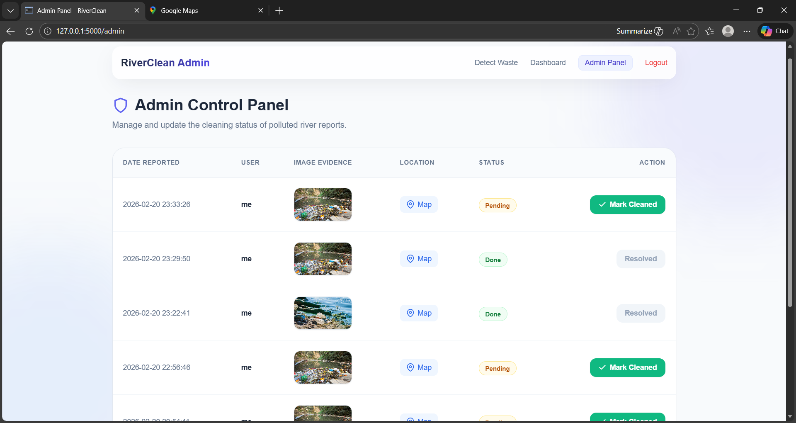

# Tink-Her-Hack-4.0
Proposing RiverClean - A web application that enables community-driven detection of river pollution using AI-powered image analysis.
<p align="center">
  
</p>

# RiverClean 

## Basic Details

### Team Member: Meliza Mariya Byiju(Individual)

### Hosted Project Link
[Add your hosted project link here if applicable, e.g., https://riverclean.onrender.com]

### Project Description
RiverClean is an AI-powered web platform that detects river pollution using image-based analysis. Users upload images of polluted rivers, and the system uses computer vision to detect waste and classify pollution severity. Authorities receive geo-tagged alerts for faster cleanup and accountability.

### The Problem statement
India faces severe river pollution due to:
- Illegal waste dumping
- Lack of real-time monitoring
- Slow response from authorities
- No structured reporting mechanism

Manual monitoring is inefficient, expensive, and non-scalable.

### The Solution
RiverClean provides:
- 📸 Crowd-powered pollution reporting
- 🤖 AI-based waste detection
- 📍 Geo-tagged complaint logging
- 🏛️ Authority dashboard for tracking & action
- 🎁 Incentive-based reporting model

This creates a scalable, transparent, and tech-driven river protection ecosystem.

---

## Technical Details

### Technologies/Components Used

**For Software:**
- **Languages used:** Python, HTML, CSS, JavaScript
- **Frameworks used:** Flask (Python backend), Custom CSS (Frontend templates)
- **Libraries used:** TensorFlow, Werkzeug, NumPy, Pillow, SQLite3
- **Tools used:** VS Code, Git

---

## Features

List the key features of your project:
- **Feature 1: AI Pollution Detection** - Leverages a custom TensorFlow/Keras deep learning model (DepthwiseConv2D) to analyze uploaded images and classify them as 'Clean' or 'Polluted'.
- **Feature 2: User & Authority Dashboards** - Separate interfaces for regular citizens (tracking their reports and earned points) and admins/authorities (viewing and managing polluted river reports).
- **Feature 3: Geo-tagged Reporting** - Captures the location of the report to inform authorities accurately of where cleanup is needed.
- **Feature 4: Incentive System** - Users receive points for verified reports of pollution, encouraging community engagement.

---

## Implementation

### For Software:

#### Installation
```bash
# Clone the repository (if applicable)
git clone https://github.com/melizabyiju/Tink-Her-Hack-4.git
cd Tink-Her-Hack-4

# Install required Python dependencies
pip install -r requirements.txt
```

#### Run
```bash
# Run the Flask application
python app.py
```
*The app will be available at http://127.0.0.1:5000*

## Project Documentation

### For Software:

#### Screenshots (Add at least 3)


*Upload Interface: Shows the file upload and location input for detecting pollution.*


*User Dashboard: Allows users to track their past reports and accumulated reward points.*


*Admin Panel: Enables authorities to review submitted 'Polluted' reports and mark them as 'Done'.*

*(Note: Replace `docs/screenshot_1.png` etc. with actual screenshot paths once captured)*

#### Diagrams

**System Architecture:**


*Explain your system architecture: Users upload images -> Flask server -> TensorFlow Model predicts status -> Results and Location saved in SQLite database -> Authorities view actionable reports in Admin Panel.*

**Application Workflow:**


*Add caption explaining your workflow: Registration/Login -> Upload image & enter location -> AI Processing -> Display result -> If Polluted: Alert Admin & Add point to user -> Admin reviews & resolves issue.*

---

## Additional Documentation

### For Web Projects with Backend:

#### API Documentation

**Base URL:** `http://127.0.0.1:5000` (Local)

##### Endpoints

**POST /detect**
- **Description:** Analyzes an uploaded image using the AI model and logs the report.
- **Parameters (Form Data):**
  - `photo` (File): Image of the river (png, jpg, jpeg)
  - `location` (string): The geographical location of the river
- **Response:**
```json
{
  "category": "Polluted",
  "location": "Kerala",
  "authorities_notified": true
}
```

**POST /update_status/<report_id>**
- **Description:** Admin endpoint to update the status of a specific pollution report to 'Done'.
- **Response:**
```json
{
  "success": true
}
```

**GET /dashboard**
- **Description:** Returns the user dashboard showing their submitted reports and current score.
- **Response:** HTML Page rendering `dashboard.html`

**GET /admin**
- **Description:** Returns the admin dashboard listing all 'Polluted' reports for action.
- **Response:** HTML Page rendering `admin.html`

[Authentication endpoints (`/login`, `/register`, `/logout`) are also available using standard GET/POST methods.]

---

### For Scripts/CLI Tools:

*(N/A - This project is a web application, no CLI tool provided)*

---

## Project Demo

### Video
[Add your demo video link here - YouTube, Google Drive, etc.]

*Explain what the video demonstrates - key features, user flow, technical highlights*

### Additional Demos
[Add any extra demo materials/links - Live site, APK download, online demo, etc.]

---

## AI Tools Used (Optional - For Transparency Bonus)

If you used AI tools during development, document them here for transparency:

**Tool Used:** [e.g., GitHub Copilot, v0.dev, Cursor, ChatGPT, Claude]

**Purpose:** [What you used it for]
- Example: "Generated boilerplate templates"
- Example: "Debugging assistance for AI model loading"
- Example: "Code review and UI optimization suggestions"

**Key Prompts Used:**
- [Add any prominent prompts used during development]

**Percentage of AI-generated code:** [Approximately X%]

**Human Contributions:**
- Architecture design and planning
- Custom business logic implementation
- Integration and testing
- UI/UX design decisions

*Note: Proper documentation of AI usage demonstrates transparency and earns bonus points in evaluation!*

---

## License

This project is licensed under the MIT License - see the [LICENSE](LICENSE) file for details.

=======
# Tink-Her-Hack-4.0
Proposing RiverClean - A web application that enables community-driven detection of river pollution using AI-powered image analysis.
<p align="center">
  
</p>

# RiverClean 

## Basic Details

### Team Member: Meliza Mariya Byiju(Individual)

### Hosted Project Link
[Add your hosted project link here if applicable, e.g., https://riverclean.onrender.com]

### Project Description
RiverClean is an AI-powered web platform that detects river pollution using image-based analysis. Users upload images of polluted rivers, and the system uses computer vision to detect waste and classify pollution severity. Authorities receive geo-tagged alerts for faster cleanup and accountability.

### The Problem statement
India faces severe river pollution due to:
- Illegal waste dumping
- Lack of real-time monitoring
- Slow response from authorities
- No structured reporting mechanism

Manual monitoring is inefficient, expensive, and non-scalable.

### The Solution
RiverClean provides:
- 📸 Crowd-powered pollution reporting
- 🤖 AI-based waste detection
- 📍 Geo-tagged complaint logging
- 🏛️ Authority dashboard for tracking & action
- 🎁 Incentive-based reporting model

This creates a scalable, transparent, and tech-driven river protection ecosystem.

---

## Technical Details

### Technologies/Components Used

**For Software:**
- **Languages used:** Python, HTML, CSS, JavaScript
- **Frameworks used:** Flask (Python backend), Bootstrap/Custom CSS (Frontend templates)
- **Libraries used:** TensorFlow/Keras, Werkzeug, NumPy, Pillow, SQLite3
- **Tools used:** VS Code, Git

---

## Features

List the key features of your project:
- **Feature 1: AI Pollution Detection** - Leverages a custom TensorFlow/Keras deep learning model (DepthwiseConv2D) to analyze uploaded images and classify them as 'Clean' or 'Polluted'.
- **Feature 2: User & Authority Dashboards** - Separate interfaces for regular citizens (tracking their reports and earned points) and admins/authorities (viewing and managing polluted river reports).
- **Feature 3: Geo-tagged Reporting** - Captures the location of the report to inform authorities accurately of where cleanup is needed.
- **Feature 4: Incentive System** - Users receive points for verified reports of pollution, encouraging community engagement.

---

## Implementation

### For Software:

#### Installation
```bash
# Clone the repository (if applicable)
git clone https://github.com/melizabyiju/Tink-Her-Hack-4.0.git
cd Tink-Her-Hack-4.0

# Install required Python dependencies
pip install -r requirements.txt
```

#### Run
```bash
# Run the Flask application
python app.py
```
*The app will be available at http://127.0.0.1:5000*

## Project Documentation

### For Software:

#### Screenshots (Add at least 3)


*Upload Interface: Shows the file upload and location input for detecting pollution.*


*User Dashboard: Allows users to track their past reports and accumulated reward points.*


*Admin Panel: Enables authorities to review submitted 'Polluted' reports and mark them as 'Done'.*

*(Note: Replace `docs/screenshot_1.png` etc. with actual screenshot paths once captured)*

#### Diagrams

**System Architecture:**


*Explain your system architecture: Users upload images -> Flask server -> TensorFlow Model predicts status -> Results and Location saved in SQLite database -> Authorities view actionable reports in Admin Panel.*

**Application Workflow:**


*Add caption explaining your workflow: Registration/Login -> Upload image & enter location -> AI Processing -> Display result -> If Polluted: Alert Admin & Add point to user -> Admin reviews & resolves issue.*

---

## Additional Documentation

### For Web Projects with Backend:

#### API Documentation

**Base URL:** `http://127.0.0.1:5000` (Local)

##### Endpoints

**POST /detect**
- **Description:** Analyzes an uploaded image using the AI model and logs the report.
- **Parameters (Form Data):**
  - `photo` (File): Image of the river (png, jpg, jpeg)
  - `location` (string): The geographical location of the river
- **Response:**
```json
{
  "category": "Polluted",
  "location": "Kerala",
  "authorities_notified": true
}
```

**POST /update_status/<report_id>**
- **Description:** Admin endpoint to update the status of a specific pollution report to 'Done'.
- **Response:**
```json
{
  "success": true
}
```

**GET /dashboard**
- **Description:** Returns the user dashboard showing their submitted reports and current score.
- **Response:** HTML Page rendering `dashboard.html`

**GET /admin**
- **Description:** Returns the admin dashboard listing all 'Polluted' reports for action.
- **Response:** HTML Page rendering `admin.html`

[Authentication endpoints (`/login`, `/register`, `/logout`) are also available using standard GET/POST methods.]

---

### For Scripts/CLI Tools:

*(N/A - This project is a web application, no CLI tool provided)*

---

## Project Demo

### Video
[Add your demo video link here - YouTube, Google Drive, etc.]

*Explain what the video demonstrates - key features, user flow, technical highlights*

### Additional Demos
[Add any extra demo materials/links - Live site, APK download, online demo, etc.]

---

## AI Tools Used (Optional - For Transparency Bonus)

If you used AI tools during development, document them here for transparency:

**Tool Used:** [e.g., GitHub Copilot, v0.dev, Cursor, ChatGPT, Claude]

**Purpose:** [What you used it for]
- Example: "Generated boilerplate templates"
- Example: "Debugging assistance for AI model loading"
- Example: "Code review and UI optimization suggestions"

**Key Prompts Used:**
- [Add any prominent prompts used during development]

**Percentage of AI-generated code:** [Approximately X%]

**Human Contributions:**
- Architecture design and planning
- Custom business logic implementation
- Integration and testing
- UI/UX design decisions

*Note: Proper documentation of AI usage demonstrates transparency and earns bonus points in evaluation!*

---

## License

This project is licensed under the MIT License - see the [LICENSE](LICENSE) file for details.

>>>>>>> 795595f3e10b8dca45411c7b32e8c0e5ece08407
